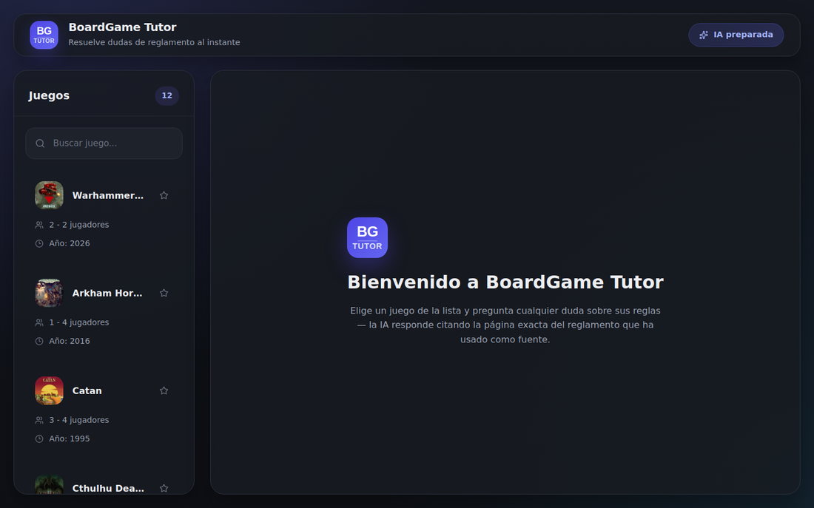
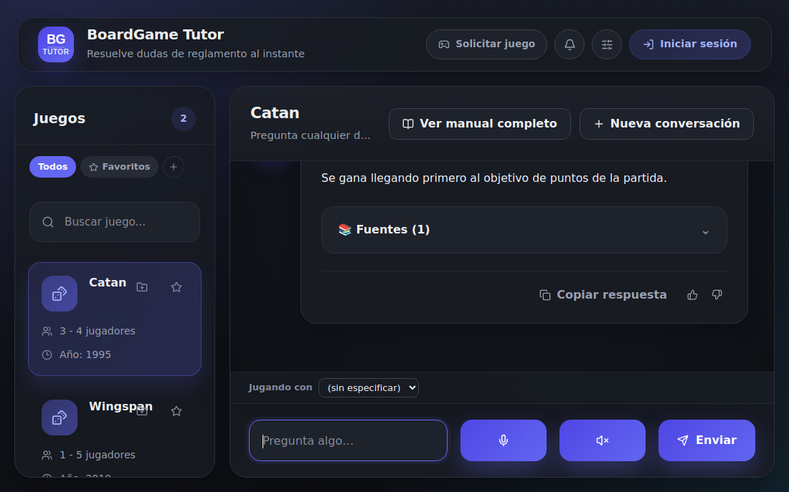
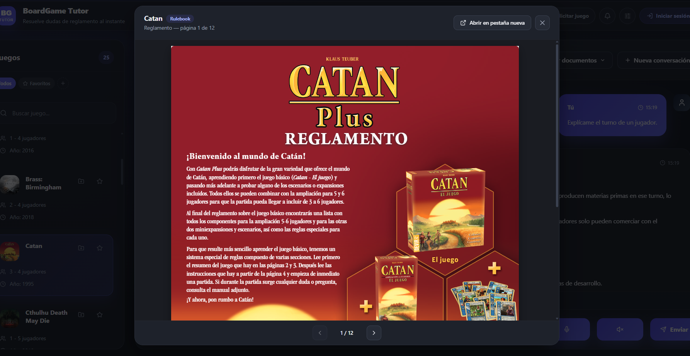
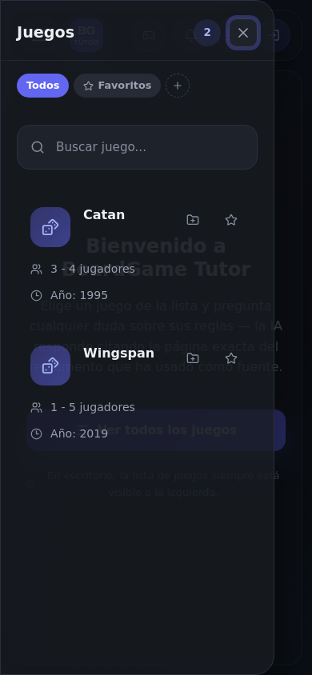

# BoardGame Tutor — Frontend

[](https://github.com/AdrianMnd/boardgame-tutor-frontend/actions/workflows/ci.yml)

🔗 **[Ver demo en vivo](https://boardgametutor.vercel.app)**

Aplicación web en React que permite elegir un juego de mesa, preguntarle en lenguaje natural sobre sus reglas y consultar el reglamento en PDF, saltando directamente a la página que se usó como fuente de cada respuesta. Cuenta con cuenta de usuario opcional para sincronizar favoritos, categorías y conversaciones entre dispositivos.

Repositorio del backend: [boardgame-tutor-backend](https://github.com/AdrianMnd/boardgame-tutor-backend)

## Capturas

| Bienvenida y favoritos | Conversación con fuentes |
|---|---|
|  |  |

| Visor de PDF integrado | Vista móvil |
|---|---|
|  |  |

## Características

- **Respuestas en streaming**: el texto aparece progresivamente (Server-Sent Events), no hay que esperar a la respuesta completa.
- **Memoria conversacional y modo de jugadores**: entiende preguntas de seguimiento, y puede indicarse con cuántos jugadores se está jugando para respuestas más precisas — ambos completamente opcionales.
- **Pregunta por voz**: dictado con la Web Speech API nativa del navegador, sin backend ni coste adicional.
- **Respuestas leídas en voz alta** (opcional, con conmutador propio): mismo principio que el dictado, pero de salida — útil con las manos ocupadas con fichas del juego.
- **Visor de PDF integrado** (`pdf.js`, no un `<iframe>`): salta a la página exacta usada como fuente de cada respuesta, de forma fiable en cualquier dispositivo — incluidos navegadores móviles.
- **Cuenta de usuario opcional**: registro, login, edición de perfil. Sin cuenta, la aplicación funciona igual de bien — solo cambia dónde se guardan los datos.
- **Favoritos y categorías personalizadas**: locales en este dispositivo sin cuenta, sincronizados entre dispositivos con cuenta.
- **Historial de conversación por juego**, con el mismo comportamiento dual local/cuenta.
- **Valoración rápida de respuestas** (👍/👎), con o sin cuenta.
- **Tema claro/oscuro**, elegido explícitamente la primera vez (sin autodetectar el sistema), con paleta completa por variables CSS.
- **Aviso de juegos nuevos**: indicador en la cabecera con los juegos añadidos al catálogo desde la última visita, persistente durante toda la sesión.
- **Solicitud de juegos nuevos**: formulario para proponer un juego con enlace a BoardGameGeek y PDF del reglamento (opcional).
- **Panel de administración**: solo visible para la cuenta configurada como administradora — revisión de solicitudes, restablecimiento de contraseñas y resumen de valoraciones.
- **Instalable como PWA**, con caché de portadas y manuales ya consultados para poder reabrirlos sin conexión.
- **Pantalla de bienvenida**: recibe al usuario con acceso directo a sus favoritos, sin forzar la entrada a un juego concreto.
- **Totalmente responsive**: panel de juegos como *drawer* deslizante en móvil, diseño adaptado desde 320px hasta escritorio.
- **Accesible**: navegación por teclado con atrapado de foco en diálogos (WAI-ARIA), avisos `aria-live` para las respuestas del chat, contraste verificado (WCAG AA).
- **Carga diferida** del visor de PDF y del chat — ninguno de los dos forma parte de la carga inicial de la app.
- **Recuperación ante errores**: un `ErrorBoundary` evita que un fallo inesperado deje la pantalla en blanco.
- **Cero usos de `any`** en TypeScript.

## Tecnologías

- React 19 + TypeScript, Vite
- TanStack React Query
- `vite-plugin-pwa` (instalación y caché offline)
- `react-pdf` / `pdfjs-dist` (carga diferida)
- React Markdown + remark-gfm (carga diferida junto con el chat)
- lucide-react
- Vitest + Testing Library (tests unitarios)
- Playwright (tests end-to-end, con un backend simulado propio)

## Puesta en marcha local

```bash
npm install
cp .env.example .env.local
npm run dev
```

Necesitas el [backend](https://github.com/AdrianMnd/boardgame-tutor-backend) corriendo (por defecto en `http://localhost:3000`) para que la aplicación tenga datos con los que funcionar.

## Scripts

```bash
npm run dev          # servidor de desarrollo
npm run build        # compilar para producción
npm run lint         # ESLint
npm run test         # tests unitarios (Vitest + Testing Library)
npm run test:watch   # tests unitarios en modo watch
npm run test:e2e     # tests end-to-end (Playwright)
npm run test:e2e:ui  # tests E2E en modo interactivo (útil para depurar)
npm run preview      # servir la build de producción en local
```

Ver [`docs/DEVELOPMENT.md`](docs/DEVELOPMENT.md) para el detalle de cada uno, incluida la arquitectura de los tests E2E.

## Estructura

```text
src/
├── assets/            # logo e imágenes propias
├── components/
│   ├── Admin/           # panel de administración (solo cuenta admin)
│   ├── Auth/           # login, registro, edición de perfil
│   ├── Chat/            # conversación, mensajes, fuentes, valoraciones (carga diferida)
│   ├── ErrorBoundary/    # captura errores inesperados de renderizado
│   ├── GameRequest/       # formulario de solicitud de juegos nuevos
│   ├── Header/             # cabecera, menú de perfil, novedades
│   ├── Layout/              # estructura general y workspace
│   ├── Sidebar/              # panel de juegos (drawer en móvil, favoritos, categorías)
│   ├── PdfViewer/              # visor de PDF con pdf.js (carga diferida)
│   ├── Theme/                   # selector de tema claro/oscuro
│   ├── Welcome/                  # pantalla de bienvenida
│   └── UI/                        # componentes reutilizables
│   (cada componente con tests trae su carpeta __tests__/)
├── contexts/           # ConversationContext (local o sincronizado según haya sesión)
├── hooks/              # useAuth, useChat, useConversation, useFavorites,
│                       # useCategories, useTheme, useNewGames, useFocusTrap...
├── services/            # clientes HTTP (games, chat, auth, favorites, categories...)
├── test/                 # configuración global de Vitest
└── types/                 # tipos compartidos

e2e/                    # tests end-to-end (Playwright) + backend simulado propio
```

## Seguridad de configuración

`VITE_API_URL` se incrusta en el bundle de producción durante la compilación — no debe contener secretos, y hay que recompilar (no solo redesplegar) si cambia.

## Más documentación

- [`docs/ARCHITECTURE.md`](docs/ARCHITECTURE.md) — decisiones de diseño: streaming, visor de PDF, autenticación y persistencia dual, tema, carga diferida.
- [`docs/DEVELOPMENT.md`](docs/DEVELOPMENT.md) — flujo de trabajo en local, tests unitarios y end-to-end.
- [`docs/DEPLOYMENT.md`](docs/DEPLOYMENT.md) — despliegue en Vercel.
- [`docs/TROUBLESHOOTING.md`](docs/TROUBLESHOOTING.md) — problemas frecuentes y cómo diagnosticarlos.

Para la referencia completa de la API (endpoints, formatos, autenticación), ver [`docs/API.md`](https://github.com/AdrianMnd/boardgame-tutor-backend/blob/master/docs/API.md) en el repositorio del backend — es la fuente única de esa información, para no mantener dos copias que puedan desincronizarse.

## Licencia

ISC — ver [LICENSE](./LICENSE).
